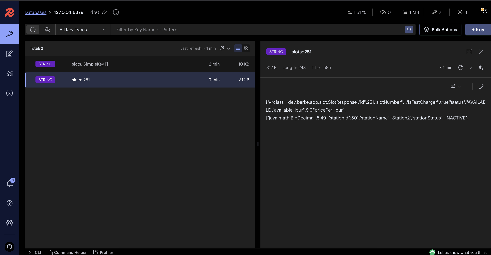
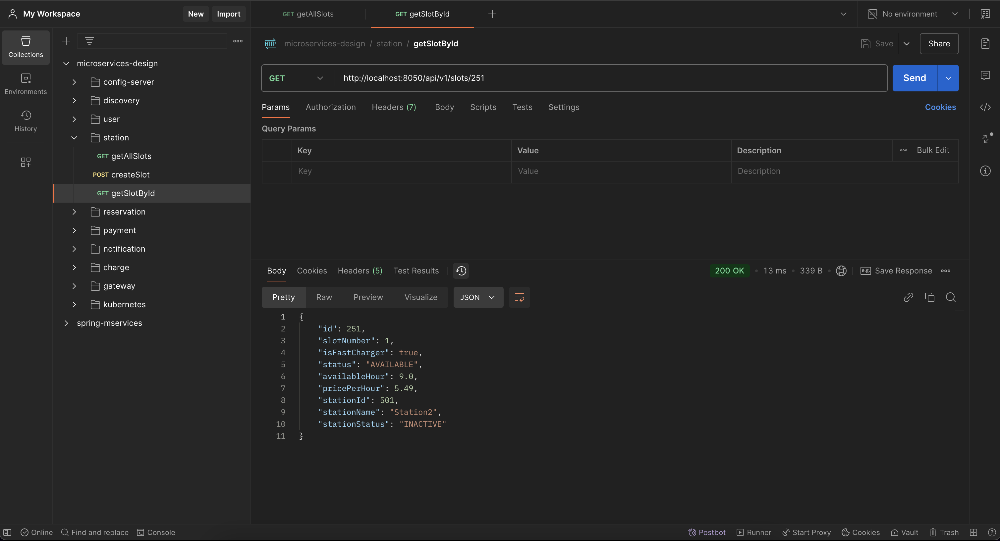

# Microservices Design

## About The Project

1. [Running The Application](#run)
2. [Technology Stack](#tech-stack)
3. [Microservices Setup](#microservices)
4. [API Gateway And Redis For Routing And Caching](#gateway)
5. [External API Integration](#external-api)
6. [Dockerization Of Microservices](#dockerization)
7. [Kubernetes Deployment](#kubernetes)
8. [CI/CD Pipeline Configuration](#pipeline)
9. [Next Features](#next-features)

## 1. Running The Application <a name="run"></a>

This repository contains the source code for a microservices application built using Java, Spring, Spring Cloud, API Gateway, Redis, Docker, Kubernetes, PostgreSQL and MongoDB.

This section outlines the steps required to run the application locally.

**1. Clone the repository:**

```bash
git clone https://github.com/berkesayin/microservices-design.git
    cd microservices-design
```

**2. Set up user info:** Write your username and password info for `postgres` and `mongodb` services.

**3. Build docker images:**

```bash
docker-compose up --build
```

**4. Load maven projects:** Open `pom.xml` file for each project, and load maven projects.

**5. Start Projects:** Start projects in order: `configserver`, `discovery`, `user`, `station`, `charge`, `gateway`

```bash
mvn clean install
mvn spring-boot:run
```

**6. Open discovery server:** Navigate to discovery server to check details for microservices:
http://localhost:8761/

**Microservices**

- Config server: `8888`
- Discovery: `8761`
- User: `8090`
- Station: `8050`
- Charge: `8040`
- API Gateway: `8222`

## 2. Technology Stack <a name="tech-stack"></a>

Technology stack used during the development of the project.

- **Programming Language:** Java 21
- **Framework:** Spring Boot
- **Data Persistence:**
  - **JPA/Hibernate:** Used for ORM (Object-Relational Mapping) with relational databases.
- **Databases:**
  - PostgreSQL (Relational Database)
  - MongoDB (NoSQL Database)
- **Messaging**
  - **Kafka:** For asynchronous messaging and event-driven architecture.
  - **RestTemplate:** For synchronous communication between services.
- **API Gateway & Spring Cloud:**
  - **Spring Cloud Gateway:** For routing and API management.
  - **Spring Cloud Config:** For externalized configuration management.
  - **Spring Cloud Netflix Eureka:** For service discovery (if applicable in your setup).
- **Caching:** Redis
- **Containerization:** Docker
- **Orchestration:** Kubernetes
- **Build Tool:** Maven

## 3. Microservices Setup <a name="microservices"></a>

- **User Service:** Manages user-related operations, persisting user data in Mongodb.
- **Station Service:** Manages charging station-related operations, like station and slot status and availability, storing data in PostgreSQL using JPA/Hibernate.
- **Charge Service:** Integrated with an external API to manage charging session details, potentially involving interactions with both `User` and `Station` services. Data is persisted using MongoDB.
- **Gateway Service** Routes requests to microservices.

## 4. API Gateway And Redis For Routing And Caching <a name="gateway"></a>

The API Gateway is built using `Spring Cloud Gateway` and serves as the single entry point for all requests.

- **Routing:** The API Gateway routes requests to the corresponding microservice based on the URL path.
- **Caching:** Redis is used for caching frequently accessed data. This reduces the load on microservices and improving response times.



Response time reduced to 13 ms from 450 ms with Redis Caching.



- **Service Discovery**: Depending on your implementation `Spring Cloud Netflix Eureka` is used for services discovery so that the gateway can dynamically discover the services.

## 5. External API Integration <a name="external-api"></a>

Fetched data from an external API, `Charge Station Finder`
http://localhost:8040/api/v1/charges/fetch-charging-stations?location=New%20York%2C%20NY%2C%20USA&limit=20

## 6. Dockerization Of Microservices <a name="dockerization"></a>

A sample file to dockerize a `spring - maven` service

```Dockerfile
FROM maven:3.9.6-eclipse-temurin-21 AS build
WORKDIR /app
COPY pom.xml .
RUN mvn dependency:go-offline
COPY src ./src
RUN mvn clean package -DskipTests

FROM openjdk:21-jdk-slim
WORKDIR /app
COPY --from=build /app/target/*.jar app.jar
EXPOSE 8090
ENTRYPOINT ["java", "-jar", "app.jar"]
```

This is a `multi-stage Dockerfile` with 2 stages:

- Stage 1: Maven build
- Stage 2: Runtime image

Each new commit is detected by its service name. And then, the service image changed with the new commit is tested, built, and pushed to Dockerhub registry continiously.

## 7. Kubernetes Deployment <a name="kubernetes"></a>

Deployment of microservices to kubernetes cluster explained here:

```
kubernetes/
|
├── configserver/
│   ├── config-deployment.yml
│
├── discovery/
│   ├── discovery-deployment.yml
│
├── user/
│   ├── user-deployment.yml
│   └── user-mongodb-config.yml
│   └── user-mongodb-secret.yml
│   └── user-mongodb.yml
│
├── station/
│   ├── station-deployment.yml
│   └── station-postgres-config.yml
│   └── station-postgres-secret.yml
│   └── station-postgres.yml
│
├── gateway/
│   ├── gateway-deployment.yml
└──
```

Starting minikube with docker

```sh
minikube start --driver docker
```

```sh
# docker ps
CONTAINER ID   IMAGE                                 COMMAND                  CREATED          STATUS          PORTS                                                                                                                                  NAMES
8ff62f4c2c5a   gcr.io/k8s-minikube/kicbase:v0.0.42   "/usr/local/bin/entr…"   47 seconds ago   Up 46 seconds   127.0.0.1:63218->22/tcp, 127.0.0.1:63214->2376/tcp, 127.0.0.1:63216->5000/tcp, 127.0.0.1:63217->8443/tcp, 127.0.0.1:63215->32443/tcp   minikube
```

```sh
# minikube status
minikube
type: Control Plane
host: Running
kubelet: Running
apiserver: Running
kubeconfig: Configured
```

```sh
# kubectl config get-contexts
CURRENT   NAME             CLUSTER          AUTHINFO         NAMESPACE
          docker-desktop   docker-desktop   docker-desktop
*         minikube         minikube         minikube         default
```

```sh
# get info about the node:
# kubectl get nodes -o wide
NAME       STATUS   ROLES           AGE   VERSION   INTERNAL-IP    EXTERNAL-IP   OS-IMAGE             KERNEL-VERSION    CONTAINER-RUNTIME
minikube   Ready    control-plane   27h   v1.28.3   192.168.49.2   <none>        Ubuntu 22.04.3 LTS   6.6.22-linuxkit   docker://24.0.7
```

### Deploy Configserver

Deploy configserver:

- `kubernetes/configserver/config-deployment.yml`

```sh
# kubectl apply -f config-deployment.yml
deployment.apps/configserver-deployment created
service/configserver-service created
```

```sh
# kubectl get deployments -o wide
NAME                      READY   UP-TO-DATE   AVAILABLE   AGE   CONTAINERS     IMAGES                           SELECTOR
configserver-deployment   0/1     1            0           12m   configserver   berkesayin/configserver:latest   app=configserver
```

```sh
# kubectl get services -o wide
NAME                   TYPE        CLUSTER-IP      EXTERNAL-IP   PORT(S)          AGE   SELECTOR
configserver-service   NodePort    10.103.31.136   <none>        8888:30050/TCP   12m   app=configserver
kubernetes             ClusterIP   10.96.0.1       <none>        443/TCP          27h   <none>
```

```sh
# kubectl get pods -o wide
NAME                                       READY   STATUS   RESTARTS      AGE     IP            NODE       NOMINATED NODE   READINESS GATES
configserver-deployment-75df77895b-n5glr   0/1     Error    5 (84s ago)   3m11s   10.244.0.10   minikube   <none>           <none>
```

**Optional: ** if port doesn't work, apply port forwarding

```sh
#
kubectl port-forward configserver-deployment-75df77895b-n5glr 30050:8888
Forwarding from 127.0.0.1:30050 -> 8888
Forwarding from [::1]:30050 -> 8888
```

```sh
# minikube ip
192.168.49.2
```

Access application: `minikube ip` : `nodePort`
192.168.49.2:30050

### Deploy Discovery

Deploy discovery:

- `kubernetes/discovery/discovery-deployment.yml`

```sh
# kubectl apply -f config-deployment.yml
deployment.apps/discovery-deployment created
service/discovery-service created
```

```sh
# kubectl get deployments -o wide
configserver-deployment   0/1     1            0           14m   configserver   berkesayin/configserver:latest   app=configserver
discovery-deployment      0/1     1            0           14s   discovery      berkesayin/discovery:latest      app=discovery
```

```sh
# kubectl get services -o wide
NAME                   TYPE        CLUSTER-IP      EXTERNAL-IP   PORT(S)          AGE   SELECTOR
configserver-service   NodePort    10.103.31.136   <none>        8888:30050/TCP   15m   app=configserver
discovery-service      NodePort    10.101.9.169    <none>        8761:30100/TCP   29s   app=discovery
kubernetes             ClusterIP   10.96.0.1       <none>        443/TCP          27h   <none>
```

**Optional: ** if port doesn't work, apply port forwarding

```sh
#
kubectl port-forward discovery-deployment-66844f5c6c-t6tm9 30100:8761
Forwarding from 127.0.0.1:30100 -> 8761
Forwarding from [::1]:30100 -> 8761
```

```sh
# minikube ip
192.168.49.2
```

Access application: `minikube ip` : `nodePort`
192.168.49.2:30100

### Deploy User

Deploy user:

- `kubernetes/user/user-mongodb-config.yml`
- `kubernetes/user/user-mongodb-secret.yml`
- `kubernetes/user/user-mongodb.yml`
- `kubernetes/user/user-deployment.yml`

```sh
# kubectl apply -f user-mongodb-config.yml
configmap/mongo-config created
```

```sh
# kubectl apply -f user-mongodb-secret.yml
secret/mongo-secret created
```

```sh
# kubectl apply -f user-mongodb.yml
deployment.apps/mongodb-deployment created
service/mongo-service created
```

```sh
# kubectl apply -f user-deployment.yml
deployment.apps/user-deployment created
service/user-service created
```

```sh
# kubectl get deployments -o wide
NAME                      READY   UP-TO-DATE   AVAILABLE   AGE    CONTAINERS     IMAGES                           SELECTOR
configserver-deployment   0/1     1            0           22m    configserver   berkesayin/configserver:latest   app=configserver
discovery-deployment      0/1     1            0           8m7s   discovery      berkesayin/discovery:latest      app=discovery
mongodb-deployment        0/1     1            0           102s   mongodb        mongo                            app=mongodb
user-deployment           0/1     1            0           90s    user           berkesayin/user:latest           app=user
```

```sh
# kubectl get services -o wide
NAME                   TYPE        CLUSTER-IP      EXTERNAL-IP   PORT(S)          AGE     SELECTOR
configserver-service   NodePort    10.103.31.136   <none>        8888:30050/TCP   23m     app=configserver
discovery-service      NodePort    10.101.9.169    <none>        8761:30100/TCP   8m31s   app=discovery
kubernetes             ClusterIP   10.96.0.1       <none>        443/TCP          27h     <none>
mongo-service          ClusterIP   10.108.232.55   <none>        80/TCP           2m6s    app=mongodb
user-service           NodePort    10.96.47.72     <none>        8090:30201/TCP   114s    app=user
```

**Optional: ** if port doesn't work, apply port forwarding

```sh
#
kubectl port-forward discovery-deployment-66844f5c6c-t6tm9 30201:8090
Forwarding from 127.0.0.1:30201 -> 8090
Forwarding from [::1]:30201 -> 8090
```

```sh
# minikube ip
192.168.49.2
```

Access application: `minikube ip` : `nodePort`
192.168.49.2:30201

### Deploy Station

Deploy station:

- `kubernetes/station/station-postgres-config.yml`
- `kubernetes/station/station-postgres-secret.yml`
- `kubernetes/station/station-postgres.yml`
- `kubernetes/station/station-deployment.yml`

Same deployment operations with `configserver`, `discovery` and `user service`.

### Deploy Gateway

Deploy gateway:

- `kubernetes/gateway/gateway-deployment.yml`

Same deployment operations with `configserver`, `discovery` and `user service`.

### Cluster Info

```sh
# kubectl get deployments -o wide
NAME                      READY   UP-TO-DATE   AVAILABLE   AGE     CONTAINERS     IMAGES                           SELECTOR
configserver-deployment   0/1     1            0           39m     configserver   berkesayin/configserver:latest   app=configserver
discovery-deployment      0/1     1            0           24m     discovery      berkesayin/discovery:latest      app=discovery
gateway-deployment        0/1     1            0           75s     gateway        berkesayin/gateway:latest        app=gateway
mongodb-deployment        1/1     1            1           18m     mongodb        mongo                            app=mongodb
postgres-deployment       1/1     1            1           3m5s    postgres       postgres:latest                  app=postgres
station-deployment        0/1     1            0           2m58s   station        berkesayin/station:latest        app=station
user-deployment           0/1     1            0           17m     user           berkesayin/user:latest           app=user
```

```sh
# kubectl get services -o wide
configserver-service   NodePort    10.103.31.136    <none>        8888:30050/TCP   39m     app=configserver
discovery-service      NodePort    10.101.9.169     <none>        8761:30100/TCP   24m     app=discovery
gateway-service        NodePort    10.108.86.118    <none>        8222:30500/TCP   108s    app=gateway
kubernetes             ClusterIP   10.96.0.1        <none>        443/TCP          28h     <none>
mongo-service          ClusterIP   10.108.232.55    <none>        80/TCP           18m     app=mongodb
postgres-service       ClusterIP   10.109.93.87     <none>        5432/TCP         3m38s   app=postgres
station-service        NodePort    10.108.203.189   <none>        8050:30410/TCP   3m31s   app=station
user-service           NodePort    10.96.47.72      <none>        8090:30201/TCP   18m     app=user
```

```sh
# kubectl get configmaps -o wide
NAME               DATA   AGE
kube-root-ca.crt   1      28h
mongo-config       1      19m
postgres-config    3      4m24s
```

```sh
# kubectl get secrets -o wide
NAME              TYPE     DATA   AGE
mongo-secret      Opaque   2      19m
postgres-secret   Opaque   2      4m41s
```

```sh
# kubectl get nodes -o wide
NAME       STATUS   ROLES           AGE   VERSION   INTERNAL-IP    EXTERNAL-IP   OS-IMAGE             KERNEL-VERSION    CONTAINER-RUNTIME
minikube   Ready    control-plane   28h   v1.28.3   192.168.49.2   <none>        Ubuntu 22.04.3 LTS   6.6.22-linuxkit   docker://24.0.7
```

## 8. CI/CD Pipeline Configuration <a name="pipeline"></a>

The CI/CD pipeline is configured with the following steps, using GitHub Actions.

With the pipeline configuration used during the development of the project, each new commit is detected by its service name. And then, the service image changed with the new commit is tested, built, and pushed to Dockerhub registry continiously.

- **Job**: `build-and-deploy` 1.**Code Checkout:** Fetches the code from the repository. 2. **Set up Java:** Configures the environment with Java 21. 3. **Install Docker Compose:** Installs the Docker Compose tool. 4. **Detect Changes:** Identifies which microservices have been modified since the last commit and skips building unchanged services to speed up the process. 5. **Set up Docker Buildx:** Configures Docker Buildx for advanced build capabilities. 6. **Docker Login:** Authenticates with the Docker Hub (or berkesayin container registry). 7. **Start Dependencies:** Starts required dependent services such as configuration server, discovery server MongoDB and Postgres if needed for tests. 8. **Run Linting:** Performs code linting to ensure code quality. 9. **Run Unit Tests:** Executes unit tests. 10. **Package Application:** Packages updated microservices into an executable artifact, JAR file. 11. **Build and Push Docker Image:** Builds a Docker image for each modified microservice and pushes it to the berkesayin container registry.
- **Note:** The next job will be to deploy the latest docker images to the kubernetes cluster, which is not implemented here.

## 9. Next Features <a name="next-features"></a>

This section outlines the next features:

- **Service Expansion:** We plan to develop and containerize the following new microservices:
  - `Reservation Service`: To handle reservation and scheduling of charging sessions.
  - `Payment Service`: To manage payment processing for charging sessions.
  - `Notification Service`: To provide users with timely notifications regarding charging and reservations.
- **Communication Improvements:**
  - Implement asynchronous communication using `Kafka` for loosely coupled interactions between services.
  - Utilize `RestTemplate` for synchronous communication where immediate responses are necessary.
- **External Data Handling Enhancements:**
  - Enhance the `Charge Service` to normalize the data fetched from external sources before persisting it to the database, which includes transforming it into the correct format for our database.
  - Publish normalized data to a dedicated Kafka topic, enabling downstream services to consume and utilize the processed data.
  - Develop microservices that can subscribe to specific Kafka topics and store the data into a PostgreSQL database.
- **Deployment and API Modernization:**
  - Package the application deployment using `Helm`, which makes managing deployments significantly more efficient.
  - Transition to a `GraphQL API` to enable more advanced and flexible queries, replacing the `REST endpoints`.
